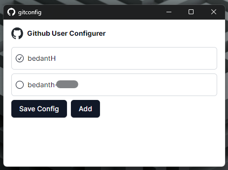
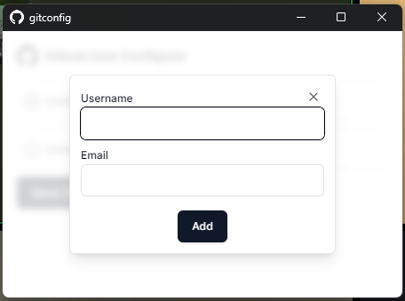
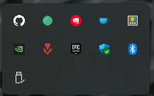

# Git Configurer

## What ? 🤔
**GitHub Configuration Switcher** is a small desktop utility designed to make it easy to switch between multiple GitHub configurations on your desktop. This tool is particularly useful if you have multiple GitHub accounts, such as a personal account and an organizational account, and often find it messy to manage them.

## Why ? 🤷

Managing multiple GitHub accounts can be cumbersome, especially when you forget to switch accounts while working on different projects. This utility aims to solve this problem by providing a simple interface to store multiple configurations and quickly switch between them.

## What can it do ? ⚙️

-   **Multiple Configurations**: Store multiple GitHub configurations, including email addresses and usernames.
-   **Startup Reminder**: Automatically opens on PC boot, reminding you to switch accounts beforehand.
-   **System Tray Access**: Always stays in your system tray for quick and easy access.

## Usage
1.  On first launch, the application will prompt you to add your GitHub configurations.
2.  Add your personal and organizational GitHub accounts with their respective email addresses and usernames.
3.  The application will remind you to switch configurations on PC boot.
4.  Access the application anytime from the system tray to switch accounts quickly.

## Screenshots
The main desktop application screen: \

Adding configuration screen: \

Application present in system tray: \

## License
This project is licensed under the MIT License - see the LICENSE file for details.

## Releases
Checkout releases to download `.exe` file for your use